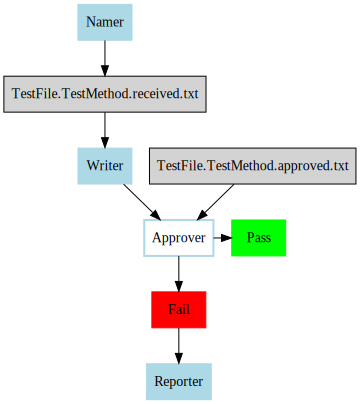

<!--
GENERATED FILE - DO NOT EDIT
This file was generated by [MarkdownSnippets](https://github.com/SimonCropp/MarkdownSnippets).
Source File: /docs/ApprovalTests/explanations/mdsource/MainConcepts.source.md
To change this file edit the source file and then execute run_markdown.cmd.
-->

# Main Concepts in ApprovalTests

<!-- toc -->
## Contents

  * [Verify](#verify)
    * [What it does?](#what-it-does)
    * [How it does it?](#how-it-does-it)
    * [General usage](#general-usage)
    * [Why would you customize it?](#why-would-you-customize-it)
  * [Writers](#writers)
    * [What it does?](#what-it-does-1)
    * [How it does it?](#how-it-does-it-1)
    * [General usage](#general-usage-1)
    * [Why would you customize it?](#why-would-you-customize-it-1)
  * [Namers](#namers)
    * [What it does?](#what-it-does-2)
    * [How it does it?](#how-it-does-it-2)
    * [General usage](#general-usage-2)
    * [Why would you customize it?](#why-would-you-customize-it-2)
  * [Reporters](#reporters)
    * [What it does?](#what-it-does-3)
    * [How it does it?](#how-it-does-it-3)
    * [General usage](#general-usage-3)
    * [Why would you customize it?](#why-would-you-customize-it-3)
  * [Approval Output Files](#approval-output-files)
    * [What it does?](#what-it-does-4)
    * [How it does it?](#how-it-does-it-4)
    * [General usage](#general-usage-4)
    * [Why would you customize it](#why-would-you-customize-it)<!-- endtoc -->

## Verify
### What it does?
### How it does it?
### General usage
### Why would you customize it?

The entry point to ApprovalTests is almost always some variation of a [Verify method](../Verify.md).

For example: 
<!-- snippet: simple_verify -->
<a id='snippet-simple_verify'/></a>
```cs
[Test]
public void Text()
{
    Approvals.Verify("should be approved");
}
```
<sup><a href='/src/ApprovalTests.Tests/ApprovalsTest.cs#L13-L19' title='File snippet `simple_verify` was extracted from'>snippet source</a> | <a href='#snippet-simple_verify' title='Navigate to start of snippet `simple_verify`'>anchor</a></sup>
<!-- endsnippet -->

This call brings together 3 things + default Approver to produce a `.received.` file which is compared to an `.approved.` file.



**Note:** This is a simplified version of what ApprovalTests does. You can see a [full picture here](MainConceptsComplete.svg)

## Writers
### What it does?
[Writers](https://github.com/approvals/ApprovalTests.Net/blob/master/src/ApprovalTests/Core/IApprovalWriter.cs) are responsible for writing the `.received.` file to the disk.
They also determine the extension for both `.received.` and `.approved.` files.

### How it does it?
Eventually, all Verify methods call:
<!-- snippet: complete_verify_call -->
<a id='snippet-complete_verify_call'/></a>
```cs
public static void Verify(IApprovalWriter writer, IApprovalNamer namer, IApprovalFailureReporter reporter)
```
<sup><a href='/src/ApprovalTests/Approvals.cs#L45-L47' title='File snippet `complete_verify_call` was extracted from'>snippet source</a> | <a href='#snippet-complete_verify_call' title='Navigate to start of snippet `complete_verify_call`'>anchor</a></sup>
<!-- endsnippet -->

Most of the time this is hidden in an underlying a Verify call.

### General usage
The vast majority of the time you will not interact directly with the Writers.

### Why would you customize it?
If you want it to approve something that writes to a new type of a binary file, you would create a custom Writer.

If you simply wanted to format text this is usually done in a separate step before calling:
<!-- snippet: verify_with_extension -->
<a id='snippet-verify_with_extension'/></a>
```cs
public static void VerifyWithExtension(string text, string fileExtensionWithDot, Func<string, string> scrubber = null)
```
<sup><a href='/src/ApprovalTests/Approvals.cs#L179-L181' title='File snippet `verify_with_extension` was extracted from'>snippet source</a> | <a href='#snippet-verify_with_extension' title='Navigate to start of snippet `verify_with_extension`'>anchor</a></sup>
<!-- endsnippet -->

## Namers
### What it does?
[Namers](https://github.com/approvals/ApprovalTests.Net/blob/master/src/ApprovalTests/Core/IApprovalNamer.cs) are responsible for figuring out what the `.approved.` and `.received.` files should be called and where they are located.

### How it does it?
This is primarily done by inspecting a stack trace to detect your test framework's attributes. 

The naming pattern is: `{ClassName}.{MethodName}.{AdditionalInformation(optional)}.approved.{Extension}`

### General usage
The vast majority of the time you will not interact directly with the Namers.

### Why would you customize it?
To **support a new testing framerwork** is a main reason you would create your own Namer.

## Reporters
### What it does?
[Reporters](https://github.com/approvals/ApprovalTests.Net/blob/master/src/ApprovalTests/Core/IApprovalReporter.cs) are called only on failure.
They are responsible for things such as opening Diff tools, copying commands to your clipboard or anything else that can help you determine what went wrong and so you can fix it.

### How it does it?
Reporters are very simple. They are called with a recieved and approved file names on failure. Usually, they make a call to a command line using these filenames as parameters.

For example: `YourDiffTool filename1 filename2`

### General usage
It is very common to switch between Reporters for both personal preferences (a preferred Diff tool) and contextual preferences (at this moment I want to...).

Because using the right Reporter at the right time is so important, there are multiple places they can be configured, including which Reporter is the default Reporter.

### Why would you customize it?
There are two reasons you want to write your custom Reporter:
1. To support a tool you like that is not currently supported 
1. To change the order in which Diff tools are selected

## Approval Output Files
### What it does?
The core of Approvals is that your result and expectations are saved in output files. These files allow us to verify expectations in future runs as well as use external tools.

### How it does it?
Approvals create two files:
* Actual: `ClassName.TestMethodName.received.txt`
* Expected: `ClassName.TestMethodName.approved.txt`
  
The actual files (`.received.`) are deleted on success and should never be checked on your source control.  
The expected files (`.approved.`) need to be checked into your source control.

### General usage
Every ApprovalTest will be generating these files.

### Why would you customize it
The two main ways of customizing the output files are:
1. To store all the output files in the subdirectory
1. Adding additional information for Data Driven Tests or [machine specific tests](../EnvironmentSpecificTests.md)

---

[Back to User Guide](../readme.md#top)
